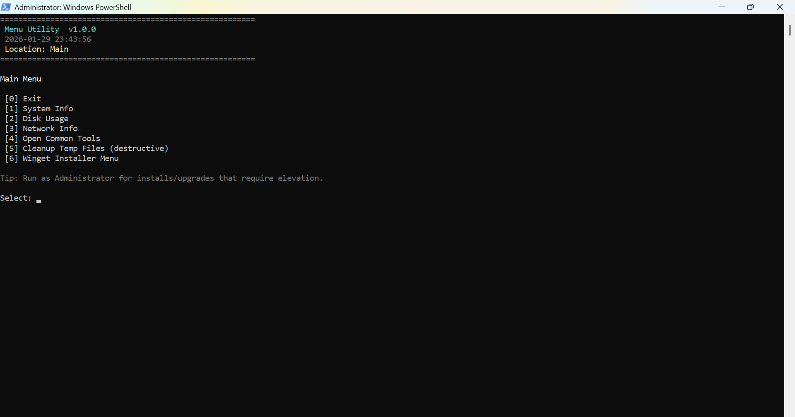
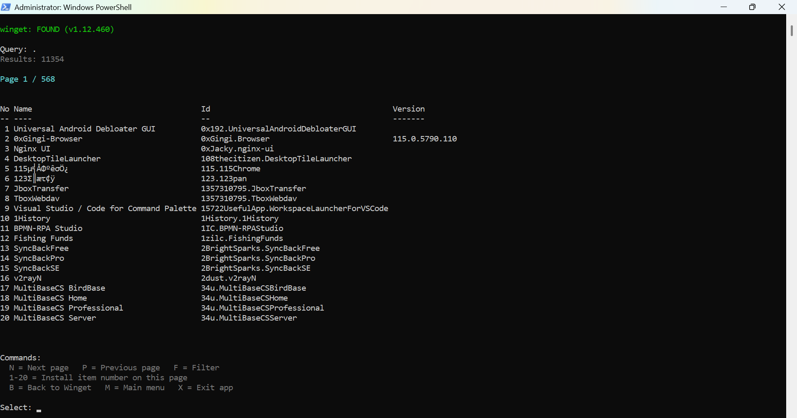
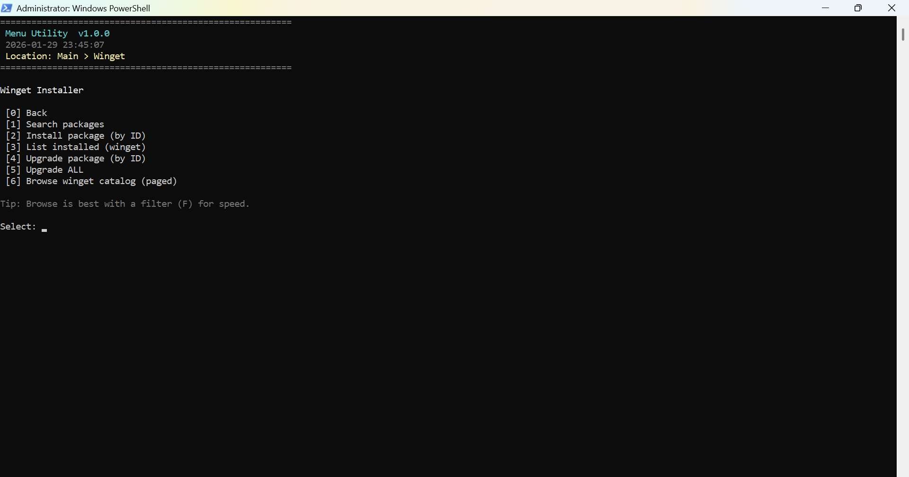

# Menu Utility (PowerShell)

A portable, menu-driven PowerShell utility for Windows:
System info, Winget installer, Software browser (paged), Maintenance tools


## Features
- Menu-driven UI (keyboard-friendly)
- Winget tools:
  - Search packages
  - Browse catalog (paged, 20 per page)
  - Install / upgrade by ID
  - Upgrade all
- System tools:
  - System information
  - Disk usage
  - Network info
  - Common tools launcher
- Maintenance:
  - Temp cleanup (with confirmation)

  ## Screenshots

<p align="center">
  
  
  
  
  
</p>


## Run instantly (no install)
Open **Windows PowerShell** and paste:

```powershell
$u = 'https://bit.ly/menu-utility'
$p = Join-Path $env:TEMP 'MenuUtility.ps1'
Invoke-RestMethod $u -UseBasicParsing -OutFile $p
powershell -NoProfile -ExecutionPolicy Bypass -File $p
